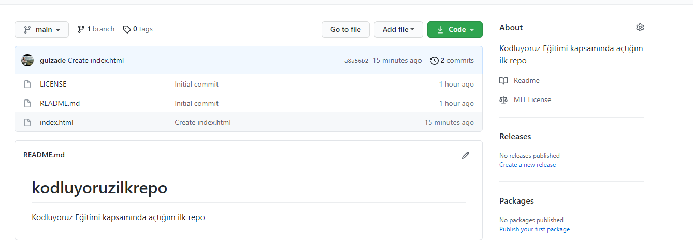

# kodluyoruzilkrepo
Kodluyoruz Eğitimi kapsamında açtığım ilk repo

Bu repo [Kodluyoruz](https://www.kodluyoruz.org) Mobil (iOS & Android)d Eğitiminde oluşturduğum ilk repo. İçerisinde bir adet README dosyası, bir adet de index.html barındırıyor.




## Installation

proje clone işlemi

```bash
git clone https://github.com/gulzade/kodluyoruzilkrepo.git
```

## Usage

Projemizi cloneladıktan sonra Visual Studio Code programında açalım

Linux için:
```linux
cd kodluyoruzilkrepo
code .
```

## Contributing
Pull request işlemi

## License
[MIT](https://choosealicense.com/licenses/mit/)
